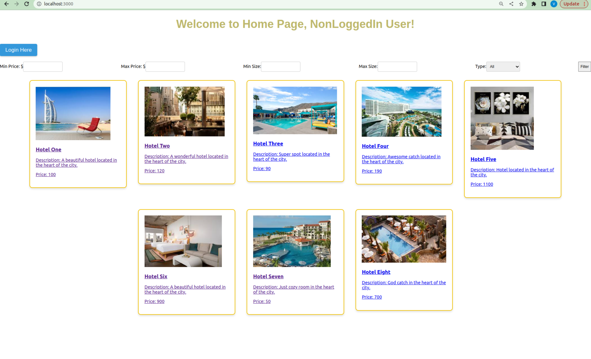
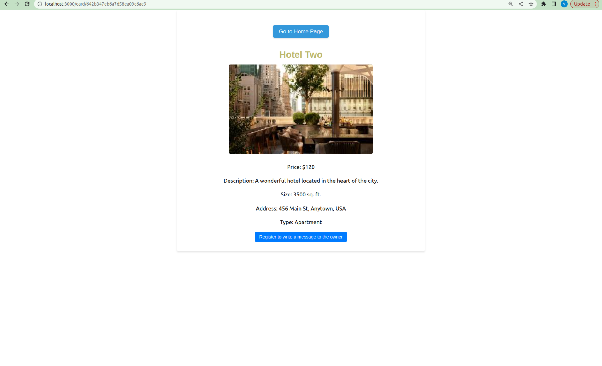

# Project: 
# Website to Book Accommodation

# Tools:
- Frontend: React.js
- Backend: Node.js
- Database: MongoDB

# Screens:

## Main Page
Displays the list of available accommodation. Each listed property has pic and short description. 
There are also available filters: on price, size, and type. 

## Detailed Page
When clicking on any accommodation card, a page with details will open.
Card Detailed Page includes:

- Name
- Picture(s)
- Price
- Size
- Address
- Description
- Type

## Login Page
The screen displays a login form with fields to input email and password. 
If a user inserts correct credentials, he or she will be successfully logged in.  
There is validation on each field.

