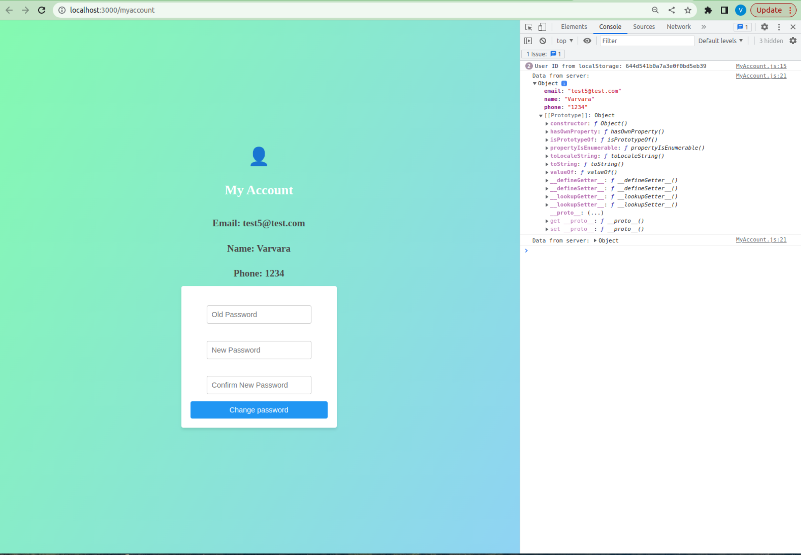

# :bulb: Project: 
# Accommodation Booking Site

# :rocket: Tools:
- **Frontend**: React.js
- **Backend**: Node.js
- **Database**: MongoDB

# :memo: Nota Bene:

- Dockerfiles are written

- npm start from route file will launch both frontend and backend

# Screens:

## Main Page
Upon visiting the website, users are greeted with a curated selection of available accommodations, each entry showcased with a vivid photo and a concise description to quickly convey the essence of each option. This initial presentation is both visually appealing and informative, streamlining the decision-making process for prospective guests.

To enhance user experience, the website features a robust filtering system. Users can refine their search based on key criteria such as price, size, and accommodation type, from luxurious villas to budget-friendly hostels. This customization makes the search more efficient and tailored to individual preferences.

The website also intelligently addresses user login. A login button is prominently displayed for guests who haven't signed in, facilitating easy access to their accounts or encouraging new visitors to create one. This not only streamlines the booking process for returning users but also enriches the experience for new members with features like saved searches and personalized recommendations, fostering a more engaged user community.

In essence, the website marries aesthetic design with functional excellence, offering a user-centric platform that simplifies the accommodation discovery and booking process.

## Detailed Page
Clicking on any accommodation card opens a detailed page for that listing, which includes the following information:

- Name
- Picture(s)
- Price
- Size
- Address
- Description
- Type

This layout ensures users have all the essential details at their fingertips, facilitating an informed decision-making process.

**Note:** If there are several pictures, the user can use 
**carousel.**

## Login Page

Upon accessing the platform, users are greeted with a user-friendly login interface, designed to facilitate secure and straightforward access. This interface includes two primary fields: one for the user's email address and another for their password. To proceed, users are required to fill in these fields with their credentials. Successful entry of the correct credentials grants the user access to their account, seamlessly integrating them into the platform's ecosystem.

Moreover, to enhance user experience and ensure data integrity, the system implements robust validation checks on each input field. These checks are meticulously designed to verify the accuracy and format of the data provided by the user. For the email field, the validation ensures that the input adheres to the standard email format, while the password field checks may include criteria such as minimum length and the inclusion of both alphanumeric and special characters. These validations are crucial for maintaining the platform's security standards and providing users with guidance should their inputs fall short of the requirements. Through this comprehensive approach, the platform not only safeguards user accounts but also streamlines the login process, making it as efficient and user-friendly as possible.

## Registration Page
Allow a user input email and password. Once saved, the corresponding record 
can be applied to log in to the site.

## Screen for Logged Users
In addition, if a user is logged, he or she will also see Logout button.
**My Account** section (separate component) should be visible to logged users only. 

## My Account Page
The user is able to change the current password with a new one. Once submitted, 
a new password will overwrite the old password in MongoDB.

