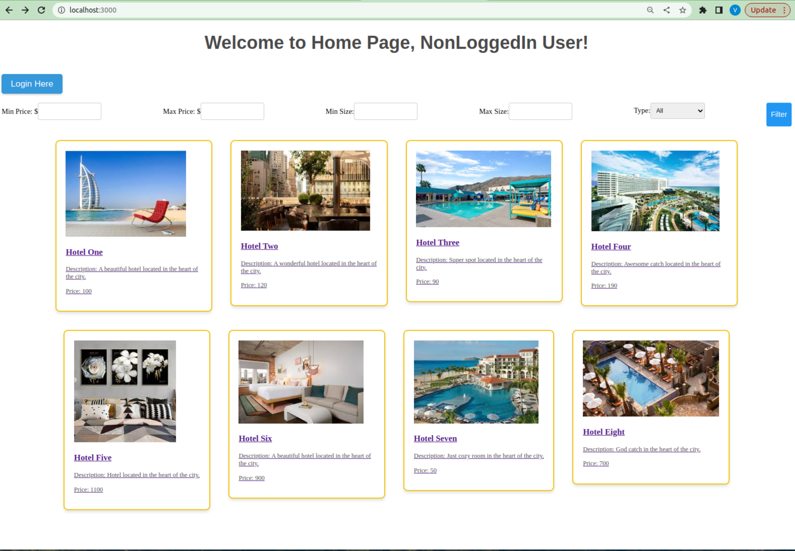
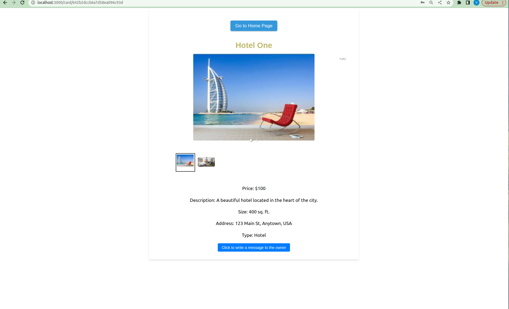
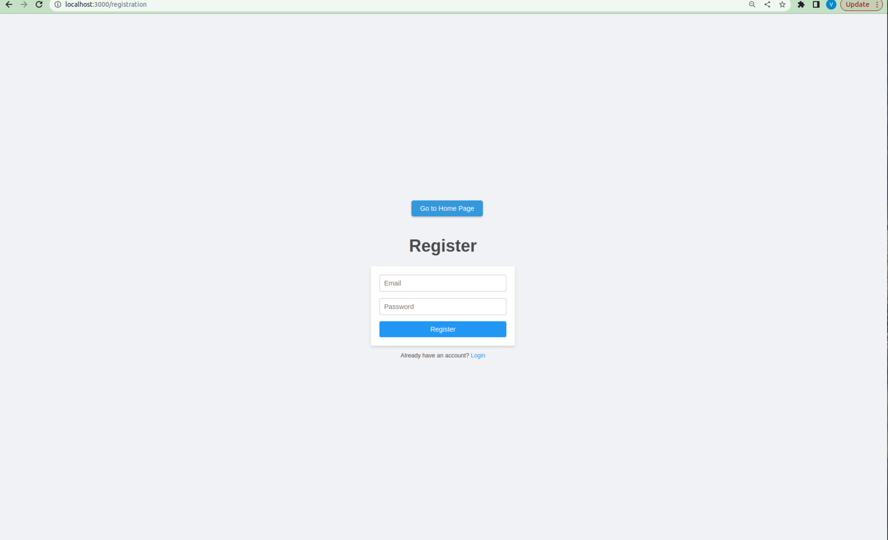

# Project: 
# Accommodation Booking Site

# Tools:
- **Frontend**: React.js
- **Backend**: Node.js
- **Database**: MongoDB

# Screens:

## Main Page
Displays the list of available accommodation. Each listed property has pic and short description. 
There are also available **filters**: on price, size, and type. 
**Login** button is only displayed for non-logged users.

## Detailed Page
When clicking on any accommodation card, a page with details will open.
Card Detailed Page includes:

- Name
- Picture(s)
- Price
- Size
- Address
- Description
- Type

**Note:** If there are several pictures, the user can use 
**carousel.**

## Login Page
The screen displays a login form with fields to input email and password. 
If a user inserts correct credentials, he or she will be successfully logged in.  
There is validation on each field.

## Registration Page
Allow a user input email and password. Once saved, the corresponding record 
can be applied to log in to the site.

## Screen for Logged Users
In addition, if a user is logged, he or she will also see Logout button.
**My Account** section (separate component) should be visible to logged users only. 

